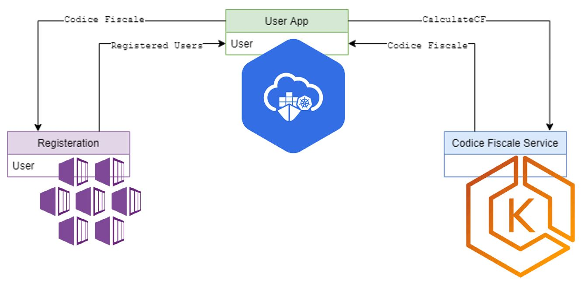

# microservices-design-and-impl-on-multiple-CSP
AWS - OCI -AZURE

# APPLICATION

## **1- Codicefiscale service (AWS)**

Codicefiscale is a tax code that is used in Italy in english can be written as fiscal code. Here codicefiscale service calculates the  fiscal code [(Rules to calculate fiscal code)](https://en.wikipedia.org/wiki/Italian_fiscal_code) and is developed using **KOTLIN** + **SPRING BOOT**, which interacts with mongodb as backend database.  
We are going to deploy this microservice on AWS in the following steps:

### **Step1: Provisioning a cluster**
The tool eksctl CLI simplify to create cluster on EKS (Elastic Kubernetes Service).

<code>eksctl create cluster --name=polito-cluster --nodes=1 --node-type=t2.small</code>

Execution of this comand creates one cluster named **polito-cluster**, that uses t2.small Amazon Elastic Compute Cloud (EC2) like a worker node. After the cluster is ready, EKS connects to **kubectl**. We can check node to verify whether it is connected to the cluster or not.  

<code>kubectl get nodes</code>

### **Step2: Deploying microservice**
The first step of deploying to kubernetes is to build your microservice and containerize them. Go inside the directory fiscalcode  

<code>cd Tesina/fiscalcode</code>

then, run the following command

<code>docker build -t fiscalcode .</code>

to create the image of microservice. In the above last command <code>-t fiscalcode</code> defines the name of the image and <code>.</code> is the position of Dockerfile e the code of our application. It executes the command step by step described in the Dockerfile.

### **Step3: Pushing the image to container registry**
- Authenticate docker client to your ECR (Elastic container registry). The folloeing command returns the password string and save in variable PASSWORD  
<code>PASSWORD=$(aws ecr get-login-password)</code>

- Next, to get the aws-account-id and save in variable ACCOUNT using:  
<code>ACCOUNT=$(aws sts get-caller-identity --output text --query "Account")</code>
- Configure your account using command docker login as follows  
<code>docker login -u AWS -p $PASSWORD https://$ACCOUNT.dkr.ecr.eu-west-1.amazonaws.com</code>
- Once login succeeded in the previous command create a repository to archive the image  
<code>  aws ecr create-repository --repository-name fiscalcode</code>
- You need to tag your container images with the relevant data about your registry. Tag the image with the URI of the repository created in the previous command  
<code>docker tag fiscalcode [fiscalcode-repository-uri]:0.0.1-SNAPSHOT</code>
- After tagging, push your image, remember to replace [fiscalcode-repository-uri], with your repository URI  
<code>docker push [fiscalcode-repository-uri]:1.0-SNAPSHOT</code>

### **Step4: Deploying the microservices**
Now that image of container has been created, now distribute them using the definition of kubernetes resources. A definition of kubernetes risource is yaml file. 
- For this there are two yaml files one for mongodb and the second for fiscalcode service inside the directory <code>/fiscalcode/kube/</code>, move inside the directory and run the following command to deploy the resources as defined in the kube directory.  
<code>kubectl apply -f kube</code>
- Before making a request to the [hostname]:32250, 32250 is the nodeport defined inside the fiscalcode/kube/knote.yaml, needs to modify the security group to allow the incoming traffic on port 32250.   
<code>aws ec2 describe-security-groups --filters Name=group-name,Values="*eksctl-polito-cluster-nodegroup*"  --query "SecurityGroups[*].{Name:GroupName,ID:GroupId}"</code>
- Take note of security group string from previous command and use in the following command to insert the rule in security group  
<code>aws ec2 authorize-security-group-ingress --protocol tcp --port 32250 --group-id sg-045d420e266e16b68 --cidr 0.0.0.0/0</code>
- Get the external ip from the following command and check it in the browser with  
[hostname]:32250/swagger-ui.html   
<code>kubectl get nodes -o wide</code>

## **2- Registration Service (OCI)**
This service saves the informations regarding user in database, like registration. The steps to deploy this microservice is almost the same as in the previous microservice. But it is deployed on **OCI**.

### **Step1: Create Cluster**
To create the cluster in OCI, here I used terraform, in which defined all the possible parameters for authentication to **Oracle Cloud Infrastructure (OCI)**. Clone the [repository](https://github.com/oracle-terraform-modules/terraform-oci-oke) and change the parameters according to your need

---

> **_terraform.tfvars sample_**  
api_fingerprint = "api fingerprint"  
api_private_key_path = "private key"  
region = "eu-frankfurt-1"  
tenancy_id = "tenancy id"  
user_id = "user id"  
compartment_id = "compartment id"  
label_prefix = "choose a labe prefix"  
ssh_private_key_path = "path ssh private key"  
ssh_public_key_path = "path ssh public key"  
create_drg = false  
drg_display_name = "drg"  
lockdown_default_seclist = false  
netnum = {  
&ensp;&ensp;&ensp;&ensp;bastion = 0  
&ensp;&ensp;&ensp;&ensp;cp = 2  
&ensp;&ensp;&ensp;&ensp;int_lb = 16  
&ensp;&ensp;&ensp;&ensp;operator = 1  
&ensp;&ensp;&ensp;&ensp;pub_lb = 17  
&ensp;&ensp;&ensp;&ensp;workers = 1  
}  
newbits = {  
&ensp;&ensp;&ensp;&ensp;bastion = 14  
&ensp;&ensp;&ensp;&ensp;cp = 14  
&ensp;&ensp;&ensp;&ensp;lb = 11  
&ensp;&ensp;&ensp;&ensp;operator = 14  
&ensp;&ensp;&ensp;&ensp;workers = 2  
}  
vcn_cidr = "choose a cidr" # example 10.0.0.0/16  
vcn_dns_label = "oke"  
vcn_name = "oke vcn"  
bastion_access = "ANYWHERE"  
bastion_enabled = true  
bastion_image_id = "Autonomous"  
bastion_notification_enabled = false  
bastion_notification_endpoint = "email_address"  
bastion_notification_protocol = "EMAIL"  
bastion_notification_topic="bastion_server_notification"  
bastion_operating_system_version = "7.9"  
bastion_package_upgrade = false  
bastion_shape = {  
&ensp;&ensp;&ensp;&ensp;shape = "VM.Standard.E3.Flex",  
&ensp;&ensp;&ensp;&ensp;ocpus = 1,  
&ensp;&ensp;&ensp;&ensp;memory = 4,
&ensp;&ensp;&ensp;&ensp;boot_volume_size = 50  
}  
bastion_state = "RUNNING"  
bastion_timezone = "Europe/Rome"  
operator_enabled = true  
operator_image_id = "Oracle"  
operator_instance_principal = true  
operator_notification_enabled = false  
operator_notification_endpoint = ""  
operator_notification_protocol = "EMAIL"  
operator_notification_topic= "operator_server_notification"  
operator_package_upgrade = true  
operator_shape = {  
&ensp;&ensp;&ensp;&ensp;shape = "VM.Standard.E3.Flex",  
&ensp;&ensp;&ensp;&ensp;ocpus = 1,  
&ensp;&ensp;&ensp;&ensp;memory = 4,  
&ensp;&ensp;&ensp;&ensp;boot_volume_size = 50  
}  
operator_timezone= "Europe/Rome"  
operator_version = "8"  
availability_domains = {  
&ensp;&ensp;&ensp;&ensp;bastion = 1  
&ensp;&ensp;&ensp;&ensp;operator = 1  
}  
tags = {  
&ensp;&ensp;&ensp;&ensp;vcn = {  
&ensp;&ensp;&ensp;&ensp;&ensp;&ensp;&ensp;&ensp;environment = "lab"  
&ensp;&ensp;&ensp;&ensp;}  
&ensp;&ensp;&ensp;&ensp;bastion = {  
&ensp;&ensp;&ensp;&ensp;&ensp;&ensp;&ensp;&ensp;environment = "lab"  
&ensp;&ensp;&ensp;&ensp;&ensp;&ensp;&ensp;&ensp;role = "bastion"  
&ensp;&ensp;&ensp;&ensp;}  
&ensp;&ensp;&ensp;&ensp;operator = {  
&ensp;&ensp;&ensp;&ensp;&ensp;&ensp;&ensp;&ensp;environment = "lab"  
&ensp;&ensp;&ensp;&ensp;&ensp;&ensp;&ensp;&ensp;role = "operator"  
&ensp;&ensp;&ensp;&ensp;}  
}  
admission_controller_options = {  
&ensp;&ensp;&ensp;&ensp;PodSecurityPolicy = false  
}  
allow_node_port_access = false  
allow_worker_ssh_access = true #false  
cluster_access = "public"  
cluster_access_source = "0.0.0.0/0"  
cluster_name = "oke"  
check_node_active = "none"  
dashboard_enabled = false  
kubernetes_version = "v1.18.10" # we can upgrade cluster to "v1.19.7" later in
this lesson  
node_pools = {  
&ensp;&ensp;&ensp;&ensp;np1 = {shape="VM.Standard.E2.1",node_pool_size=1}  
&ensp;&ensp;&ensp;&ensp;np2 = {shape="VM.Standard.E2.1",node_pool_size=1}  
}  
node_pools_to_drain = [ "np1", "np2" ]  
nodepool_drain = false  
nodepool_upgrade_method = "out_of_place"  
node_pool_name_prefix = "np"  
node_pool_image_id = "none"  
node_pool_os = "Oracle Linux"  
node_pool_os_version = "7.9"  
pods_cidr = "10.244.0.0/16"  
services_cidr = "10.96.0.0/16"  
use_signed_images = false  
worker_mode = "private"  
lb_subnet_type = "public"  
preferred_lb_subnets = "public"  
public_lb_ports = [80, 443]  
waf_enabled = false  
email_address = ""  
secret_id = "none"  
secret_name = "ocirsecret"  
username = ""  
calico_enabled = false  
metricserver_enabled = true #false  
vpa = {  
&ensp;&ensp;&ensp;&ensp;enabled = false,  
&ensp;&ensp;&ensp;&ensp;version = 0.8  
}  
use_encryption = false  
existing_key_id = ""  
image_signing_keys = ["ocid1.key.oc1....", "ocid1.key.oc1...."]  
create_service_account = true  
service_account_name = "kubeconfigsa"  
service_account_namespace = "kube-system"  
service_account_cluster_role_binding = "cluster-admin"  
---

- Once completed the file run the following commands to create the cluster on **OCI**  
<code>terraform init  
terraform validate  
terraform plan  
terraform apply</code>

- In case of error in previous  
<code>sudo nano /etc/resolv.conf  
then write 8.8.8.8</code>

### **Step2: Create docker image and push on repository**
- Inside <code>/Tesina/register</code> run   
<code>docker build –t register .</code>
- Authenticate docker client to your docker hub  
<code>docker login</code>
- Tag image with the repository  
<code>docker tag register mnakhtar247/register:0.0.1-SNAPSHOT</code>
- Push the image on repository  
<code>docker push mnakhtar247/register:0.0.1-SNAPSHOT</code>

### **Step3: Deploying the microservice on OCI**
- To access **OCI** cluster locally, go to the OCI console search your cluseter in OKE with the name used in **Step1** and check the local access command in **Access**. It'll be something like this  
<code>oci ce cluster create-kubeconfig --cluster-id [cluster-id] --file kubeconfig --region eu-frankfurt-1 --token-version 2.0.0  --kube-endpoint PUBLIC_ENDPOINT</code>
- Run the following commands to deploy the resources as defined in <code>/Tesina/register/kube</code> directory  
<code>kubectl --kubeconfig kubeconfig apply -f kube
</code>

- Get the external ip from the following command and check it in the browser with  
[hostname]/swagger-ui.html   
<code>kubectl --kubeconfig kubeconfig get nodes -o wide</code>

## **3- User app service (Azure)**
This service will call the endpoint of fiscalcode service **(AWS)** and registration service **(OCI)** 

### **Step1: Provisioning a cluster**
- Running the following command creates an AKS cluster that is called **polito-cluster** with the resource group **cloud-akhtar-tesina**  
<code>az aks create -g clud-akhtar-tesina -n polito-cluster</code>
- By default, three nodes are assigned to the node pool
- To add nodes manually option --node-count -c can be added in the above command

### **Step2: Create docker image and push on repository**
- Inside <code>/Tesina/userapp</code> run   
<code>docker build –t register .</code>
- Authenticate docker client to your docker hub  
<code>docker login</code>
- Tag image with the repository  
<code>docker tag register mnakhtar247/userapp:0.0.1-SNAPSHOT</code>
- Push the image on repository  
<code>docker push mnakhtar247/userapp:0.0.1-SNAPSHOT</code>

### **Step3: Deploying the microservice on Azure**
Now that your container images are built, deploy them using a Kubernetes resource definition.

- Merge the credentials of your cluster into your current Kubernetes configuration by using the az aks get-credentials command. The default Kubernetes configuration file that is updated with your cluster credentials is located within the ~/.kube/config filepath  
<code>az aks get-credentials -g clud-akhtar-tesina -n polito-cluster</code>

- Run the following commands to deploy the resources as defined in <code>/Tesina/userapp/kube</code> directory  
<code>kubectl apply -f kube</code>

- Get the external ip from the following command and check it in the browser with  
[external-ip]/swagger-ui.html   
<code>kubectl get nodes -o wide</code>